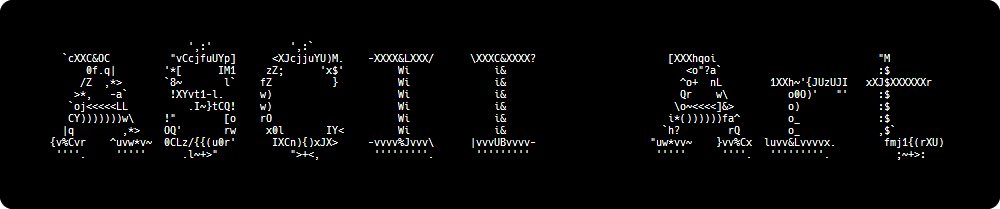

# ASCII Art Generator



## Brief description of the algorithm

1. Set width and height of the font
2. Choose a grayscale ramp
3. Upload an image
4. Convert it to grayscale
5. Select tiles (of font's width x height) from the image
   1. Compute the average brightness of each tile
   2. Map the brightnessof each tile to a character from the ramp
   3. Concatenate the characters to form the ASCII art

## How 2 use

Requirements:

- Python
- PIL

Run the script with the following command:

```bash
python asciiart.py "path/to/image"
```

Have fun!

## License

This project is licensed under the terms of the MIT license. See the [LICENSE](LICENSE) file.
